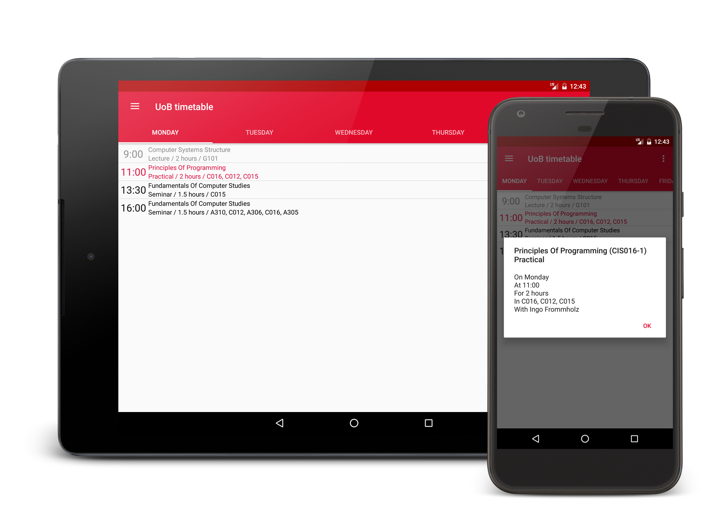

# UoB timetable

__⚠️ This application has been removed from Google Play more than five years after first being published due to a trademark infringement notice from the University of Bedfordshire. Due to a lack of response from the email addresses listed on the notice it is unlikely that the issue can be resolved leading to the application listing being reinstated. Development has been discontinued because of this.__

This application displays the 5-day timetable for any University of Bedfordshire
course.

## Features

- Detailed information for each session including the unit, time and rooms
- Session hiding
- Session reminder notifications
- Term dates
- Offline support

## Builds

See [releases](releases) tab for APKs and changelogs

## Dev Notes

- Minimum API 15 (4.0.3)
- Enable debug view by tapping the app bar in MainAcitivity 7 times
- To log errors to Bugsnag, add Bugsnag key to `UOB_TIMETABLE_BUGSNAG` env var before building

## License

[GPL v3](license.md)
